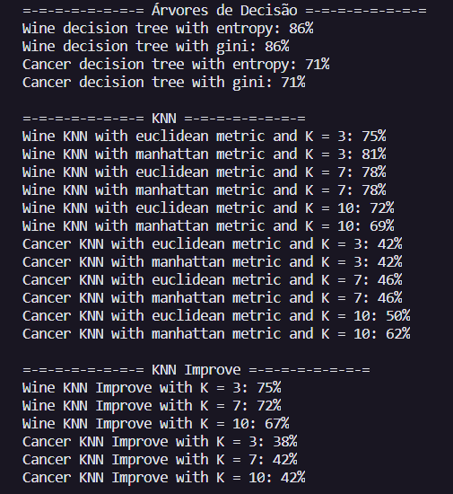

# Primeiro projeto da disciplina de Tópicos Especias do Curso Superior de Tecnologia em Sistemas para Internet do IFPB

## Descrição

O objetivo é comparar os resultados de algoritmos de Machine Learning com problemas de classificação.

## Tecnologias

As seguintes ferramentas foram usadas na construção do projeto:

- [Python](https://www.python.org/)
- [Scikit-learn](https://scikit-learn.org/stable/)
- [Pandas](https://pandas.pydata.org/)

## Datasets

Foram escolhidas duas bases de dados do [UCI](https://archive.ics.uci.edu/ml/index.php) para a comparação entre os algoritmos.

- [Wine Data Set](https://archive.ics.uci.edu/ml/datasets/Wine): Possui dados que são resultados de uma análise química de vinhos cultivados na mesma região na Itália, mas derivados de três cultivares diferentes;
- [Breast Cancer Coimbra Data Set](https://archive.ics.uci.edu/ml/datasets/Breast+Cancer+Coimbra): Possui dados sobre câncer de mama com 10 preditores, todos quantitativos e uma variável dependente binária, indicando a presença ou ausência de câncer de mama.

## Algoritmos Testados

- 2 árvores de decisão com o criterion = "gini" e "entropy";
- 6 kNN usando 2 medidas de distância diferentes ("euclidean" e "manhattan") e 3 tamanhos de vizinhança (3, 7 e 10);
- 3 kNN Improve usando 3 tamanhos de vizinhança (3, 7 e 10).

## Protocolo Experimental

O conjunto de dados foi divido da seguinte forma: 80% para treinamento e 20% para testes. Todos os algoritmos foram treinados com os mesmos dados.

## Relatório

Ao final da execução é exibido os resultados (taxas de acerto) de todos os algoritmos.

